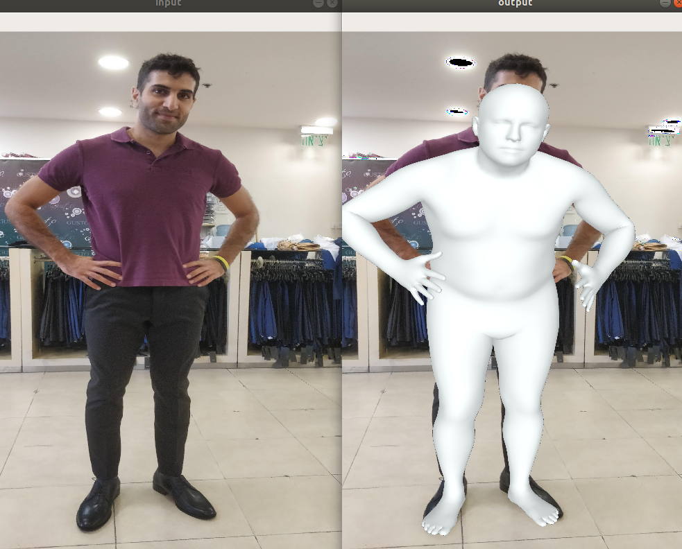

# Visualize3DHumanModels
A tool that visualize 3D models of humans on an image.

## Demo
This tool supports 2 modules
### Visualize single mesh
Run the following script:

`
python Demo.py --image_path input/img.jpg 
--smpl_params_path input/img_3d_params.pkl 
--smpl_model_folder {PATH TO SMPL MODEL}
`

### Visualize multiple meshes
Run the same script but change Demo.py to run the function named understanding_3d_model_params_module

## Prerequisites

### Programs
Python 3.6

### Python packages
pip install requirements.txt

### SMPL model
download SMPL models from - http://smpl.is.tue.mpg.de/downloads
1. Go to the file downloaded and extract the files.
2. Take the pkl files from smpl/models folder (in the folder you've extracted) and transfer them to smpl/ folder.
3. Rename the files to SMPL_MALE and SMPL_FEMALE accordingly.

## Output Example

Hope it helps!!
@Alon Samuel
